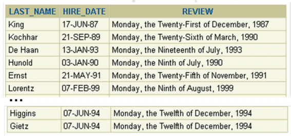
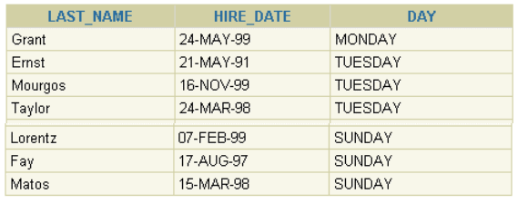

# Exercícios 3

## Funções de uma Única Linha

### 

1. Escreva uma consulta para mostrar a `data atual`. Nomeie a coluna como `Date`.

2. O departamento de RH precisa de um relatório que mostre o número do empregado, sobrenome, salário e o salário acrescido de 15,5% para cara empregado. Nomeie a coluna como `New Salary`.

4. Modifique sua consulta do `exercício 2` para acrescentar uma coluna que subtraia o salário antigo do salário novo. Nomeie essa coluna como `Increase`.

5. Para esta consulta você precisa:
  - Listar o `last_name` (com a primeira letra maiúscula); 
  - Listar a quantidade de caracteres de cada `last_name`; 
  - Listar todos os empregados cujo nome inicie com as letras J, A ou M;
  - Fornecer para cada coluna um apelido apropriado;
  - Ordenar o resultado pela coluna `last_name`.
  
| Last Name   | Quantidade de Caracteres |
|-------------|--------------------------|
|Abel         |	                        4|
|Ande         |	                        4|
|Atkinson     |    	                    8|
|Austin       |  	                      6|
|Johnson      |   	                    7|
|Jones        | 	                      5|
|Mallin       |  	                      6|
|Markle       |  	                      6|
|Marlow       |  	                      6|
|Marvins      |   	                    7|
|Matos        | 	                      5|
|Mavris       |  	                      6|
|Mccain       |  	                      6|
|Mcewen       |  	                      6|
|Mikkilineni  |                        11|
|Mourgos      |   	                    7|

6. Para esta consulta você precisa:
  - Listar o `last_name` de cada empregado;
  - Listar o `número de meses` entre hoje e a data que cada empregado foi contratado;
  - Nomeie essa coluna como `MONTHS_WORKED`;
  - `Ordene` seu resultado pelo número de meses de emprego;
  - `Arredonde` o número de meses.
  
7. Crie um relatório que liste o seguinte para cada empregado:

```
<last_name> earns <salary> monthly but wants <3 * salary>. 
```

Nomeie a coluna como `Dream Salaries`.

| Dream Salaries                                              |
|-------------------------------------------------------------|
|King earns `$24,000.00` monthly but wants `$72,000.00`.      |
|Kochhar earns `$17,000.00` monthly but wants `$51,000.00`.   |
|De Haan earns `$17,000.00` monthly but wants `$51,000.00`.   |
|...                                                          |
|                                                             |

8. Crie uma consulta para listar o `last_name` e `salary` para todos os empregados. Formate 
o salário para o tamanho de `15 caracteres`, completando a esquerda com o símbolo $. Nomeie 
a coluna como SALARY.

|last_name|salary         |
|---------|---------------|
|King	    |$$$$$$$$$$24000|
|Kochhar	|$$$$$$$$$$17000|
|De Haan	|$$$$$$$$$$17000|
|Hunold	  |$$$$$$$$$$$9000|

9. Liste cada `last_name`, `hire_date` e `salary review date` dos empregados, mostrando a 
próxima Segunda-feira após seis meses de trabalho. Nomeie a coluna como `REVIEW`. Formate 
as datas para aparecer no format semelhante a “Segunda-feira”, o Trigésimo-Primeiro de 
Julho, 2000”.

- ORACLE pode ficar assim:



- POSTGRES pode ficar assim:

|LAST_NAME| HIRE_DATE  | REVIEW 
|---------|------------|-----------------------------------
|King	    | 1987-06-17 | Monday, the 21 of December, 1987
|Kochhar	| 1989-09-21 | Monday, the 26 of March, 1990
|De Haan	| 1993-01-13 | Monday, the 19 of July, 1993
|Hunold	  | 1990-01-03 | Monday, the 09 of July, 1990
|Ernst	  | 1991-05-21 | Monday, the 25 of November, 1991

10. Para esta consulta você precisa:
  - Listar o `last_name`, `hire_date` e `dia da semana` em que cada empregado iniciou na empresa. 
  - Nomear a coluna do `dia da semana` como `DAY` e mostrar o dado todo em maiusculo. 
  - `Ordenar` o resultado pelo dia da semana, começando pela `Segunda-Feira`.
  


11. Crie uma consulta que liste os `last names` dos empregados e também a `commission amounts`. 
Se algum empregado não tiver comissão, mostre `No Comission`. Nomeie a coluna como `COMM`.

|last_name  |COMM         |
|-----------|-------------|
|Matos	    |No Comission |
|Vargas	    |No Comission |
|Russell	  |0.40         |
|Partners	  |0.30         |

12. Crie uma consulta que liste os `primeiros 8 caracteres do last name` de cada 
empregado e indique a quantidade do seus salários com asteriscos. Cada asterisco significa $ 
1000. Ordene os dados na forma descrescente de salário. Nomeie a coluna como 
EMPLOYEES_AND_THEIR_SALARIES.

| EMPLOYEES_AND_THEIR_SALARIES
|--------------------------------
|King ************************
|Kochhar *****************
|De Haan *****************
|Russell **************

13. Usando a função DECODE(Oracle) ou CASE(Postgres), escreva uma consulta que liste a grade de todos os 
empregados baseado no valor da coluna JOB_ID, usando os dados a seguir:

|Job                 |Grade
|--------------------|------
|AD_PRES             |A
|ST_MAN              |B
|IT_PROG             |C
|SA_REP              |D
|ST_CLERK            |E
|None of the above   |0

Exemplo da Resposta:

|job_id    |GRADE 
|----------|------
|AD_PRES	 |A
|AD_VP	   |0
|AD_VP	   |0
|IT_PROG	 |C