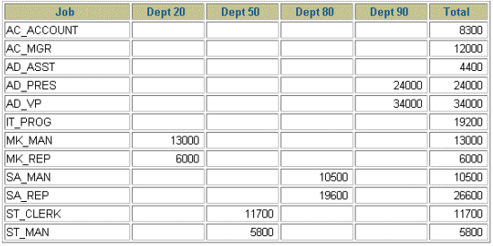

# Exercícios 4

## Agregando Dados Usando Funções de Grupo

### Verdadeiro ou Falso?
1. Funções de grupo funcionam em várias linhas para produzir um resultado por grupo.

2. Funções de grupo incluem valores nulos nos cálculos.

3. A cláusula WHERE restringe as linhas antes da inclusão no cálculo de um grupo.

### O departamento de RH necessita as seguintes consultas:

4. Para esta consulta você precisa:
  - Achar o maior, o menor, a soma e a média do salário de todos os empregados. 
  - Nomear as colunas Maximum, Minimum, Sum, and Average, respectivamente. 
  - Arredondar o resultado para o número inteiro mais próximo.
  
5. Modifique a consulta anterior para mostrar o mínimo, máximo, somatório, 
e média do salário para cada tipo de job.

6. Escreva uma consulta que liste o número de empregados com o mesmo job.

7. Determine o número de managers sem listá-los. Nomeie a coluna como `Number of 
Managers`. Dica: Use a coluna MANAGER_ID para determinar o número de managers.

8. Ache a diferença entre o maior e menor salário. Nomeie a coluna como DIFFERENCE.

9. Para esta consulta você precisa:
  - Listar o `manager_id` e o `salário` do empregado que ganha menos para cada gerente. 
  - Excluir os empregados que não possuem gerente. 
  - Excluir qualquer grupo onde o salário mínimo seja 6.000 ou menos. 
  - Ordene o resultado em ordem decrescente de salário.
  
10. Crie uma consulta que liste o número total de empregados, e desse total, o número de 
empregados contratados em 1995, 1996, 1997 e 1998. Nomeie as colunas apropriadamente.

|total|1995|1996|1997|1998
|-----|----|----|----|---- 
|107	|4   |10  |28	 |23

11. Crie uma consulta matricial para listar o job, o a soma dos salários para cada job baseado no número 
do departamento, e o salário total para cada job. Considere apenas os departamentos 20, 50, 
80 e 90.

