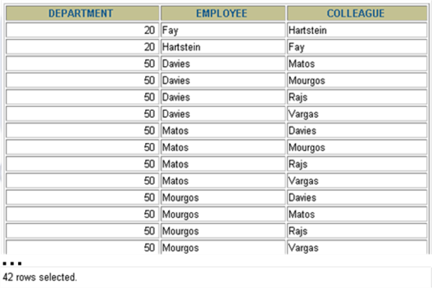

# Exercícios 5

## Exibindo Dados de Várias Tabelas

1. Escreva uma consulta com os endereços de todos os departamentos. 
Use as tabelas LOCATIONS e COUNTRIES. Mostre o location ID, sreet 
address, city, state ou province e o country.  Use o NATURAL JOIN para produzir os 
resultados.

2. Liste todos os empregados. Escreva uma consulta que mostre o last name, department number e department name para 
todos os empregados.

3. O departamento de RH necessita de uma consulta dos empregados de Toronto. 
Mostre o last name, job, department number e o department name para todos os 
empregados que trabalham em Toronto.

4. Crie uma consulta para listar o sobrenome (last name) e o número (ID) do empregado 
com o sobrenome e número do seu gerente (manager). Nomeie as colunas Employee, 
Emp#, Manager, and Mgr#, respectivamente.

|Employee  |Emp#|Manager |Mgr#
|----------|----|--------|----
|Kochhar	 |101	|King	   |100
|De Haan	 |102	|King	   |100
|Hunold	   |103	|De Haan |102
|Ernst	   |104	|Hunold	 |103

5. Modifique a consulta anteiror para mostrar todos os empregados incluindo o  
King, que não tem gerente. Ordene os resultados pelo número do empregado (ID).

6. Crie uma consulta que mostre o sobrenome (last name) e 
número do departamento (department id) do empregado, e todos os empregados que 
trabalham no mesmo departamento de um empregado fornecido. Nomeie as coluna 
apropriadamente.

7. Faça uma consulta nas faixas de salário (job grades) e 
salários. Para você se familiarizar com a tabela JOB_GRADES, primeiramente exiba a 
estrutura da tabela. Então crie uma consulta que liste o nome (name), profissão (job), 
nome do departamento (department name), salário (salary), e faixa (grade) para todos 
os empregados.

8. O departamento de RH quer determinar o nome de todos os empregados que foram 
contratados após o Davies. Crie uma consulta para mostrar o nome (name) e data de 
contratação (hire date) para todos os empregados que foram contratados após o 
Davies.

9. O departamento de RH necessita achar os nomes e datas de contratação (hire dates) 
para todos os empregados que foram admitidos antes de seus gerentes. Listar 
inclusive o nome e data de contratação (hire date) de seus gerentes.